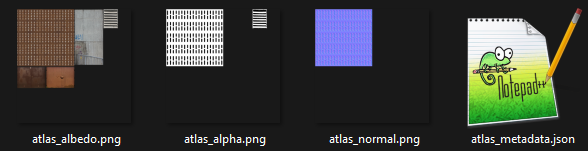

This commandline application is a lightweight tool that generates texture atlases and supporting maps from a simple configuration file. 

It creates a set of aligned atlases while leaving your original textures untouched in the input folder. This makes iteration simple: update the configuration to change scaling, add or remove textures, then rerun the tool.

## Features
- One atlas per map type – Albedo, Normal, Roughness, Metallic, Height, AO, and Alpha each get their own atlas texture.
- Smart packing – Textures are arranged as tightly as possible, and AtlasPack automatically chooses the smallest power-of-two resolution that fits them all.
- Perfect alignment – The placement of each texture is consistent across all atlas files, ensuring that albedo, normals, and other maps always line up correctly.
- Non-destructive – Original textures stay in your folder at full resolution; AtlasPack only creates new atlas files. Downscale or upscale individual textures by adjusting the configuration, without ever touching the originals.
- Flexible iteration – Add or remove textures by editing the configuration and rerunning the tool. However, textures may be moved around in the resulting atlas.
- Metadata export – Outputs a JSON file with placement and sizing information for each texture.

## How it works
1. Place your textures into a folder.
2. Add an atlas configuration file (atlas.json) describing
	- Padding
	- Default width which maps belong to each material (see example below)
3. Run the application on the folder
4. The tool generates:
	- atlas_albedo.png
	- atlas_normal.png
	- atlas_roughness.png
	- atlas_metallic.png
	- atlas_height.png
	- atlas_ao.png
	- atlas_metadata.json

Each map type is a separate atlas, but all share the same layout so that corresponding pixels always match between maps.

## Example


atlas.json:
```json
{
  "padding": 1,
  "defaultWidth": 64,
  "images": [
    { "albedo": "IMG_20220528_200253-output.png", "width": 128 },
    { "albedo": "IMG_20220528_200259-output.png", "width": 128 },
    { "albedo": "IMG_20220721_180512-output.png", "alphaMap": "IMG_20220721_180512-output_alpha.png" },
    { "albedo": "PXL_20250728_114904614.png", "width": 128 },
    { "albedo": "TCom_GutterCover_512_albedo.tif", "alphaMap": "TCom_GutterCover_512_alpha.tif", "normalMap": "TCom_GutterCover_1K_normal.tif", "width": 256 }
  ]
}
```
This will produce one albedo texture, one alpha texture and one normal texture.  
In this case a resolution of 512 by 512 was chosen.

